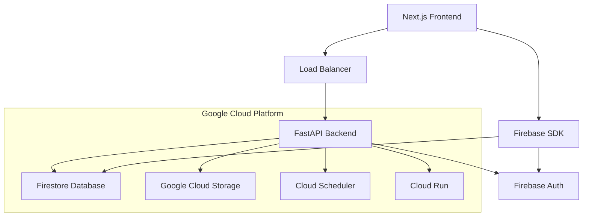
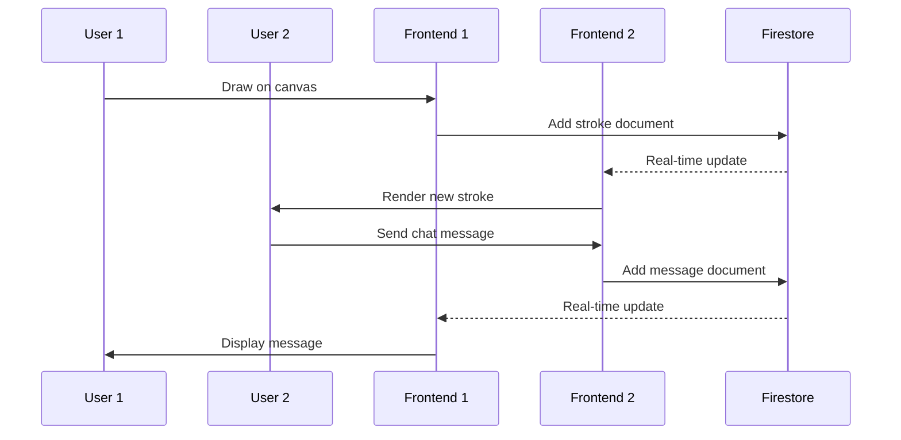
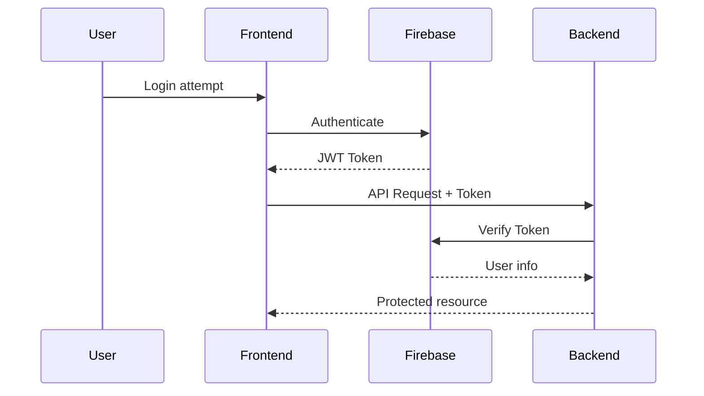
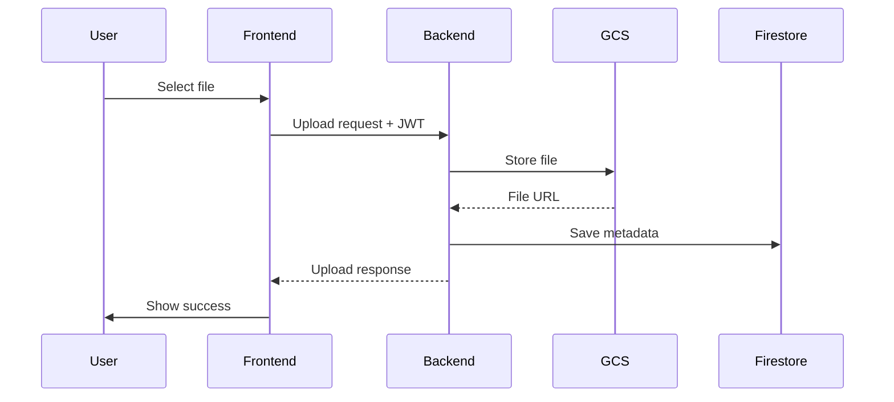

# Architecture Documentation

## Overview

The Real-time Collaborative Whiteboard is a full-stack web application built with modern technologies to enable multiple users to collaborate on drawing and chat in real-time.

## System Architecture



## Component Architecture

### Frontend (Next.js)
- **Pages**: Route-based page components
- **Components**: Reusable UI components (Canvas, Chat, Auth)
- **Contexts**: React contexts for state management (Auth, Board)
- **Utils**: Helper functions and utilities
- **Types**: TypeScript type definitions (shared package)

### Backend (FastAPI)
- **API Routes**: RESTful endpoints for file upload, cleanup
- **Middleware**: Authentication, CORS, static file serving
- **Services**: Business logic for file management, cleanup
- **Models**: Pydantic models for request/response validation

### Shared Package
- **Types**: Common TypeScript interfaces and types
- **Utilities**: Shared helper functions
- **Constants**: Application constants

## Data Flow

### Real-time Collaboration Flow



### Authentication Flow



### File Upload Flow



## Database Schema

### Firestore Collections

#### Boards
```typescript
interface Board {
  id: string
  name: string
  createdBy: string
  createdAt: Timestamp
  updatedAt: Timestamp
  isPublic: boolean
  collaborators: string[]
}
```

#### Strokes
```typescript
interface Stroke {
  id: string
  boardId: string
  userId: string
  points: Point[]
  color: string
  width: number
  timestamp: Timestamp
}
```

#### Chat Messages
```typescript
interface ChatMessage {
  id: string
  boardId: string
  userId: string
  userEmail: string
  message: string
  timestamp: Timestamp
}
```

#### User Uploads
```typescript
interface UserUpload {
  id: string
  userId: string
  filename: string
  originalName: string
  mimeType: string
  size: number
  url: string
  uploadedAt: Timestamp
  expiresAt: Timestamp
}
```

## Security Architecture

### Authentication
- Firebase Authentication with JWT tokens
- Token verification middleware in FastAPI backend
- Protected routes and API endpoints

### Authorization
- Firestore security rules for document-level access control
- User-based access to boards and uploads
- Role-based permissions for board collaboration

### Data Validation
- Pydantic models for API request/response validation
- Client-side validation for user inputs
- File type and size restrictions for uploads

## Deployment Architecture

### Development
- Local development with Next.js dev server
- Local FastAPI server with hot reload
- Firebase emulator for testing

### Production
- Frontend: Static export served by FastAPI
- Backend: Docker container on Google Cloud Run
- Database: Firestore in production mode
- Storage: Google Cloud Storage
- CI/CD: GitHub Actions

## Performance Considerations

### Frontend Optimizations
- Canvas rendering optimizations
- Debounced stroke batching
- Lazy loading for chat messages
- Static site generation where possible

### Backend Optimizations
- Async/await for non-blocking operations
- Connection pooling for database operations
- Caching for frequently accessed data
- Batch operations for cleanup tasks

### Real-time Performance
- Firestore real-time listeners
- Optimized query patterns
- Efficient data structures for strokes
- Connection management for multiple users

## Monitoring and Observability

### Logging
- Structured logging in FastAPI
- Frontend error tracking
- Audit logs for sensitive operations

### Metrics
- Application performance metrics
- Database query performance
- File upload success rates
- User activity tracking

### Health Checks
- Backend health endpoint
- Database connectivity checks
- Storage service availability
- Frontend bundle analysis

## Scalability Considerations

### Horizontal Scaling
- Stateless FastAPI backend
- Auto-scaling on Cloud Run
- Firestore automatic scaling
- CDN for static assets

### Data Partitioning
- Board-based data isolation
- User-based file organization
- Time-based data archival
- Geographic data distribution

## Security Best Practices

### Data Protection
- Encryption in transit and at rest
- Secure token storage
- Input sanitization
- Output encoding

### Access Control
- Principle of least privilege
- Regular token rotation
- Audit trails
- Rate limiting

### Infrastructure Security
- Network security groups
- Service account permissions
- Environment variable protection
- Secrets management
